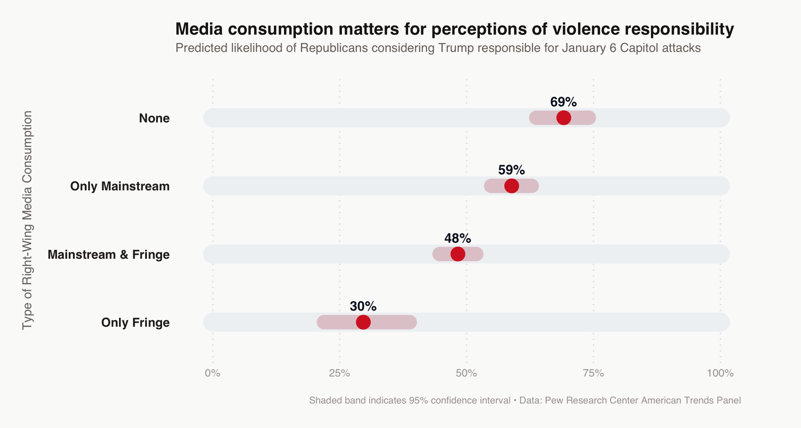
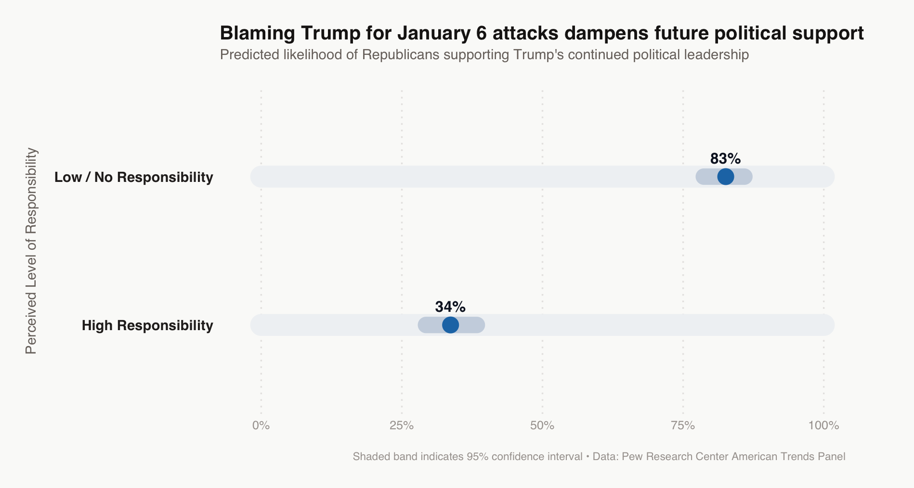

When hordes of President Trump's supporters descended on the United States Capitol building in fury on January 6, 2021, many Republicans initially condemned the violence and Trump's role in encouraging the rioters. Mere weeks later, the sentiment had shifted.

Republican members of Congress soon resisted legislative efforts to hold President Trump accountable, instead continuing to express their support for the then-lame-duck president.

An analysis of Republican survey responses from the 2021 Pew Research Center's American Trends Panel shows that this phenomenon extended beyond lawmakers, reaching deep into the media diets of everyday voters. Republican support for Trump after January 6, 2021, hinged on whether respondents blamed him for the day's events—a judgment that, in turn, varied by the type of right-wing media individuals consumed.

Republicans who engaged with fringe right-wing media, such as talk radio shows, were less inclined to hold Trump accountable for the January 6 attacks. In contrast, Republicans who primarily consumed mainstream right-wing media, such as Fox News, or did not consume any right-wing media at all, were more likely to believe Trump was responsible.

{width="100%"}

Furthermore, Republicans who considered Trump responsible for January 6 were less likely to express support for his future political endeavors.

{width="100%"}

This offers a glimpse into a fracture that continues to define the GOP today, with one faction rallying behind Trump and the other resisting what it considers an extreme-right turn shaking the pillars of peaceful democracy.
